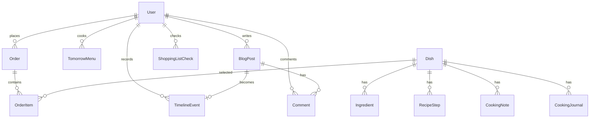

# DATABASE

## 实体关系

## 表说明

- `User`：三位家庭成员和管理员账号，包含账号名、角色和密码哈希；`role` 当前使用 `ADMIN` / `FAMILY` 字符串控制管理权限。
- `Dish`：菜品基础信息、分类、标签、封面、难度、参考价格、喜爱程度。
- `Ingredient`：菜品食材，区分主料与配料。
- `RecipeStep`：菜品步骤。
- `CookingNote`：长期追加的做菜心得。
- `CookingJournal`：菜谱成长日志，记录做法演进过程。
- `Order`：某位用户对某个计划日期的点餐。
- `OrderItem`：订单里的菜品，包含待办/已烹饪完成状态和完成时间。
- `TomorrowMenu`：某个计划日期的待办菜单状态，支持记录做饭人和完成时间。
- `Inventory`：家庭现有库存批次，记录名称、数量、单位、入库日期、保质期、失效日期和备注；数量为 0 的批次视为已处理，不参与库存汇总展示。
- `ShoppingListCheck`：买菜清单勾选状态，按计划日期和采购项 key 保存是否已买。
- `BlogPost`：家庭博客文章，按 `kind` 区分留言和系统自动记录，图片和标签以 JSON 字符串保存。
- `Comment`：博客评论。
- `TimelineEvent`：家庭时间轴事件，记录标题、内容、发生日期、作者、图片列表和可选来源小记；来源小记用于表达“日常小记沉淀为重要记忆”的关系。

## 迁移记录

### 2026-06-02 init

- 建立 Phase 1 MVP 所需全部核心表。
- 开发数据库使用 SQLite：`DATABASE_URL="file:./dev.db"`。
- Phase 1 为兼容 SQLite，角色、状态、食材类型使用字符串字段保存。
- 初始迁移脚本：`prisma/migrations/20260602192000_init/migration.sql`。

### 2026-06-02 add_inventory

- 新增 `Inventory` 表。
- 字段：`id`、`name`、`quantity`、`unit`、`updatedAt`。
- 唯一约束：`name + unit`，用于同名同单位库存合并。
- 迁移脚本：`prisma/migrations/20260602210000_add_inventory/migration.sql`。

### 2026-06-02 add_cooking_journal

- 新增 `CookingJournal` 表。
- 字段：`id`、`dishId`、`content`、`createdAt`。
- 用于记录菜品从第一次尝试到稳定版本的做法演进。
- 迁移脚本：`prisma/migrations/20260602213000_add_cooking_journal/migration.sql`。

### 2026-06-02 add_dish_price

- `Dish` 新增 `priceCents` 字段，使用分作为整数单位保存菜品参考价格。
- 点餐页面和菜品卡片读取该字段展示价格。
- 迁移脚本：`prisma/migrations/20260602220000_add_dish_price/migration.sql`。

### 2026-06-04 member_accounts

- `User` 新增 `username` 和 `passwordHash` 字段。
- `TomorrowMenu` 新增 `cookedById` 和 `completedAt` 字段，用于记录谁完成做饭。
- `BlogPost` 新增 `kind` 字段，取值目前包括 `MESSAGE` 和 `AUTO_RECORD`。
- 迁移脚本：`prisma/migrations/20260604103000_add_member_accounts/migration.sql`。
- 补充迁移 `prisma/migrations/20260604062713_member_accounts/migration.sql` 用于让 `Inventory.updatedAt` 与当前 Prisma schema 对齐。

### 2026-06-04 inventory_batches

- `Inventory` 从同名同单位唯一库存升级为批次库存。
- 新增字段：`stockedAt`、`shelfLifeDays`、`expiresAt`、`note`。
- 移除 `name + unit` 唯一约束，允许同一种物品按不同入库时间和失效日期保留多条记录。
- 买菜清单和推荐逻辑按 `name + unit` 汇总批次数量后继续抵扣。
- 迁移脚本：`prisma/migrations/20260604152000_add_inventory_batches/migration.sql`。
- 补充迁移 `prisma/migrations/20260604064138_inventory_batches/migration.sql` 用于同步 Prisma schema 对批次表索引的最终状态。

### 2026-06-05 shopping_list_checks

- 新增 `ShoppingListCheck` 表，用于持久化买菜清单勾选状态。
- 字段：`id`、`targetDate`、`itemKey`、`checked`、`checkedAt`、`checkedById`、`createdAt`、`updatedAt`。
- 唯一约束：`targetDate + itemKey`，保证同一计划日期同一采购项只有一条状态。
- 迁移脚本：`prisma/migrations/20260605201000_add_shopping_list_checks/migration.sql`。

### 2026-06-05 add_timeline_events

- 新增 `TimelineEvent` 表，用于家庭时间轴。
- 字段：`id`、`authorId`、`title`、`content`、`date`、`images`、`createdAt`、`updatedAt`。
- `images` 保存 JSON 字符串，内容为有序的时间轴照片 URL 列表；图片文件复用当前本地上传/压缩链路。
- 索引：`date`，用于按发生日期倒序展示。
- 迁移脚本：`prisma/migrations/20260605215000_add_timeline_events/migration.sql`。

### 2026-06-06 add_blog_images_tags

- `BlogPost` 新增 `images` 和 `tags` 字段。
- `images` 保存 JSON 字符串，内容为小记照片 URL 列表；图片文件复用当前本地上传/压缩链路。
- `tags` 保存 JSON 字符串，内容为小记标签列表。
- 迁移脚本：`prisma/migrations/20260606074000_add_blog_images_tags/migration.sql`。

### 2026-06-06 add_order_item_completion

- `OrderItem` 新增 `status`、`completedAt`、`completedById` 字段。
- `status=ACTIVE` 表示仍在待办菜单中；`status=COMPLETED` 表示该菜已经烹饪完成并从待办菜单清除。
- 新增索引：`status`、`completedAt`。
- 迁移脚本：`prisma/migrations/20260606094000_add_order_item_completion/migration.sql`。

### 2026-06-16 link_timeline_to_blog

- `TimelineEvent` 新增 `sourceBlogPostId` 字段，用于记录时间轴重要记忆来源于哪条日常小记。
- `sourceBlogPostId` 增加唯一索引，保证同一条小记只会沉淀为一条时间轴记忆。
- 删除原小记时，应用层会保留时间轴记忆并断开来源关系。
- 迁移脚本：`prisma/migrations/20260616093000_link_timeline_to_blog/migration.sql`。
